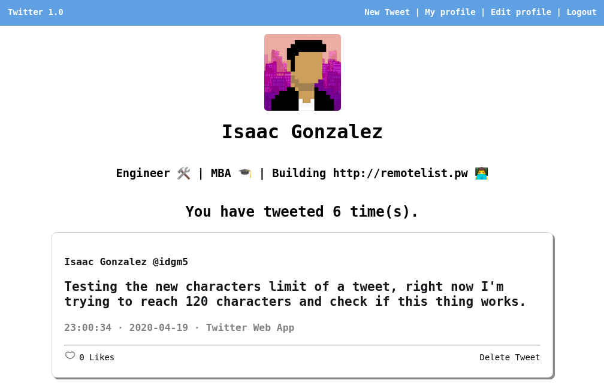

# Twitter - Development
> A Twitter clone made with ruby on rails

## Live demo
[Hosted on Heroku](https://idgm-twitter.herokuapp.com/)

## Twitter 1.0 - Includes
- Account Manager with Devise.
- Profile pictures with Gravatar.
- Limit of tweets to 120 characters.
- Tweets can receive likes.
- All tweets are presented in reverse chronology.

## Build with
- Ruby
- Ruby on Rails
- Devise
- Gravatar

## Getting started
In order to use this app:

1. You need to have ruby 2.7.0 installed. [Click here for instructions](https://www.ruby-lang.org/en/documentation/installation/)
2. You need to have ruby on rails 6.0.2.2 installed. [Click here for instructions](https://rubyonrails.org/)
3. Clone this repository `https://github.com/idgm5/twitter.git`
4. Inside twitter directory run `bundle install`
5. then run `rails server`

## Author
👤 **Isaac Gonzalez**

- Github: [@idgm5](https://github.com/idgm5)
- Twitter: [@idgm5](https://twitter.com/idgm5)
- Linkedin: [Isaac Gonzalez](https://www.linkedin.com/in/isaacmunguia)

## 🤝 Contributing

Contributions, issues, and feature requests are welcome!

Feel free to submit a new suggestion in [issues page](issues/).

## Show your support

Give a ⭐️ if you like this project!
